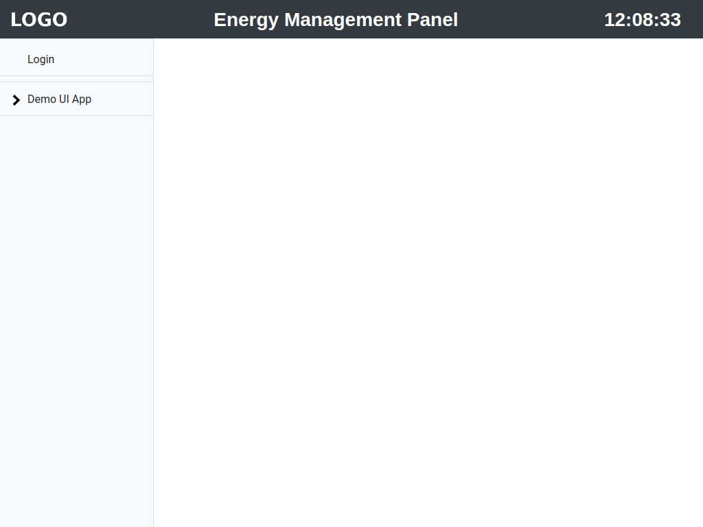
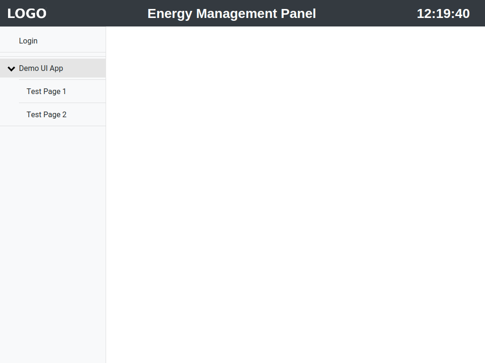

# The FZI Energy Management Panel (EMP) 

Building energy management (BEM) can be understood as the algorithmic optimization of the energy consumption patterns of buildings regarding energy efficiency and/or flexibility. However, in order to compute the optimal operational strategy, it is necessary to assess the demand of the users that must be fulfilled by the building. Such interaction between humans and the energy management system can be achieved by utilization of web based user interfaces, which is especially cost effective due to the omnipresence of computers and mobile device in modern societies. The EMP project has been designed and developed to reduce the necessary effort to implement such user interfaces. At its heart it follows a modular approach and consists of several independent components that can be combined to a user interface that matches the need of a concrete use case, which is not limited to energy management scenarios. Furthermore, it is easily possible to extend the EMP with self written components that are called apps. In order to keep such implementations as effective as possible, the EMP builds up on the [Django](https://www.djangoproject.com/) web framework, as the latter already provides many relevant functionality for such applications.

The EMP is the outcome of the continuous research on algorithmic energy management at the FZI Research Center for Information Technology, in particular the devision Intelligent Information and Communication in Technical Systems (IIK).

## Quick start

Clone the repository. Install the required dependencies, you might want to install those into an virutalenv or a conda environment.

<span style="color:red">TODO: Add correct git url</span>

```python
git clone ...
cd energy_management_panel
pip install -r requirements.txt
```

It should now be possible to start the demo version of the EMP with:

```
cd source
./manage.py runserver
```

You can now inspect a demo UI build with the EMP framwork by opening [http://localhost:8000](http://localhost:8000):



The EMP consists of a title bar on the top, a nav bar on the left and white space that is used to display the page content. The title bar contains a place for a logo on the left, the title in the middle and the current time on the right. It is possible to configure logo and title in [emp_main/settings.py](source/emp_main/settings.py). The nav bar always contains the necessary items for authentication, i.e. the Login/Logout buttons of which only the Login button is shown as the user is not authenticated yet, and one collapsible Group per installed UI app. The demo contains only one UI  app with the name "Demo UI App". Each UI app may provide multiple pages, which can be accessed by clicking on the app name in the navbar:



* [ ] Open Page
* [ ] Login
* [ ] Show restricted page.
* [ ] Manage pages with the Admin
* [ ] Show mobile view.
* [ ] Hint that more implementation details are provided in  [emp_demo_ui_app/Readme.md](source/emp_demo_ui_app/Readme.md) 


##### Todo

* [ ] Walk through the example with the demo UI app.
* [ ] Add some hints about steps that must be done after starting with a new db --> makemigrations, migrate, createsuperuser

## Contact

Please feel free to contact [David Wölfle](https://www.fzi.de/en/about-us/organisation/detail/address/david-woelfle/) for all inquiries.

## Copyright and license

Code is copyright to the FZI Research Center for Information Technology and released under the MIT license. This repository also contains copies of source code released by the [Bootsrap](https://github.com/twbs/bootstrap),  [JQuery](https://github.com/jquery/jquery) and [Popper JS](https://github.com/popperjs/popper-core) projects, which are copyright to the respective authors and released under the licenses listed in these repositories. 