# Getting Started (Interactive Demo)

## Startup

If you haven't done so already. clone the repository and enter the folder of the repo.

```python
git clone https://github.com/fzi-forschungszentrum-informatik/energy_management_panel.git
cd energy_management_panel
```

It should now be possible to start the demo version of the EMP with the following command. Note that this has only been tested on Linux systems. You might need to adjust it, especially the volume mounts for Windows or Mac.

```
USER_ID=$(id -u) GROUP_ID=$(id -g) docker-compose up --build
```

You can now inspect a demo UI build with the EMP framwork by opening [http://localhost:8080](http://localhost:8080) Change the URL of this and all later occurrences accordingly if you have launched the demo on another machine):
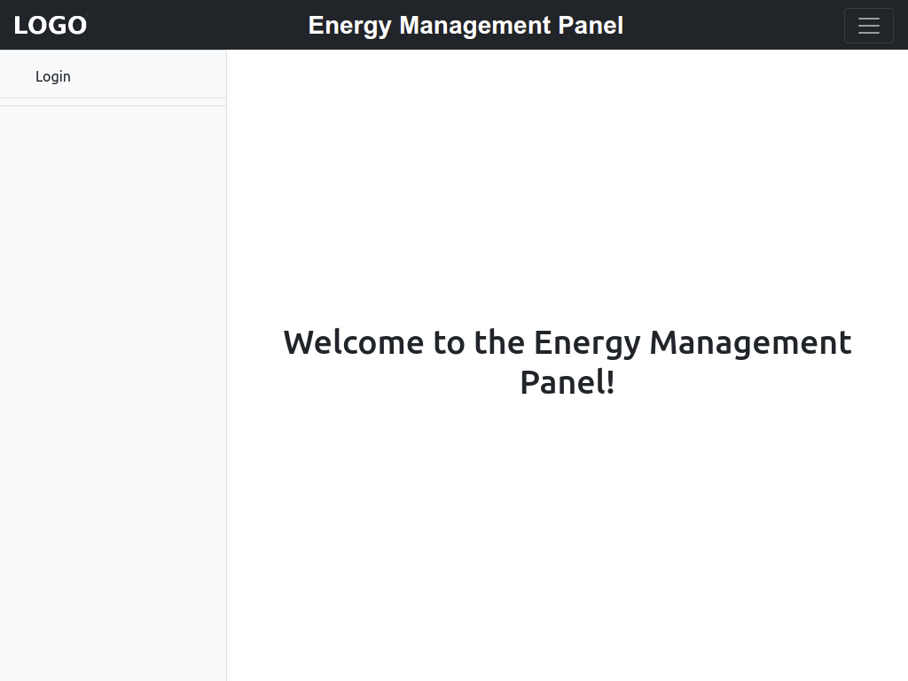

## EMP Components and Functionality

The EMP consists of a title bar on the top, a nav bar on the left and white space that is used to display the page content. The title bar contains a place for a logo on the left, the title in the middle and the [hamburger button](https://en.wikipedia.org/wiki/Hamburger_button) on the right. It is possible to configure logo and title via environment variables of the EMP container,  see the [deployment  instructions](./Deployment.md) for details. The nav bar always contains the necessary items for authentication, i.e. the Login/Logout buttons of which only the Login button is shown as the user is not authenticated yet. To proceed click "Login" in the nav bar and use the following credentials:

| Username: | Password: |
| --------- | --------- |
| test      | testuser  |

The navbar will contain one collapsible Group per installed UI app and only for those UI apps for which the user has permissions to view at least one page. For more technical information about the implementation of UI apps please see the example code at [source/emp/emp_demo_ui_app](../source/emp/emp_demo_ui_app/). The `test`  user only has acces to two pages from the "Demo UI App". Each UI app may provide multiple pages, which can be accessed by clicking on the app name in the navbar. Now click on "Demo UI App" and then on "1 - Page space to continue".

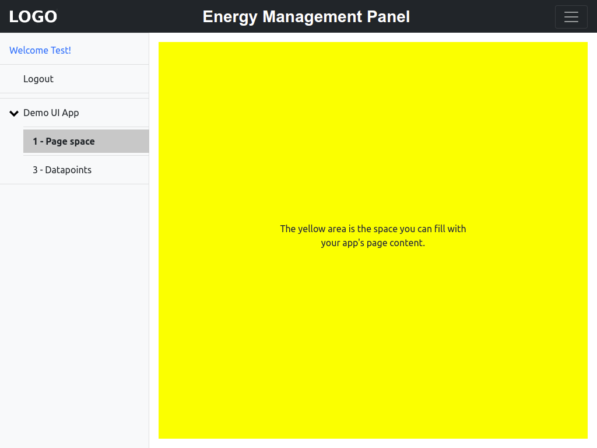

Each page can populate a defined space of the EMP with content. This space is shown in yellow in the screenshot above. When developing pages it is a good idea to keep the pages content to this marked area. If that is not possible, scrolling is ok. 
The EMP is designed to be mobile friendly. The same page will look like this on a cheap mobile phone:

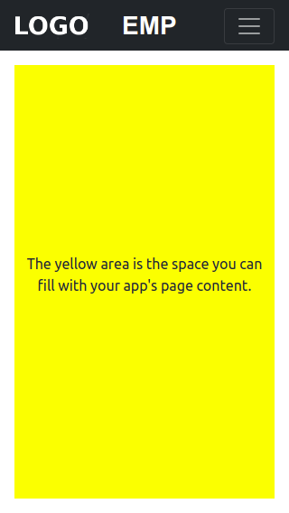

The navbar is hidden on mobiles by default to save space and can be activated by clicking on the hamburger button:


When developing pages we suggest do apply a responsive design, e.g. by using [Bootsrap](https://github.com/twbs/bootstrap) that is already used by EMP. We especially promote to check a page design with the following settings:

* A cheap mobile in with 320 x 568 pixels (in landscape and portrait mode)
* A middle class tablet with 1024 x 768 pixels (at least in portrait mode)
* A modern desktop PC with 1920 x 1080 pixels (in portrait mode)

The EMP provides out of the box features for access control. It is for example possible to provide some pages only for certain users. To present this first be aware that there is currently no page entry "2 - Permissions" in the nav bar. This is the case as the page has been restricted to be only visible for the `test2` user. Now first click "Logout" and then login again using the following credentials:

| Username: | Password: |
| --------- | ---- |
| test2 | testuser |

After this you should be able to view the restricted page by clicking on "2 - Permissions" in the nav bar.

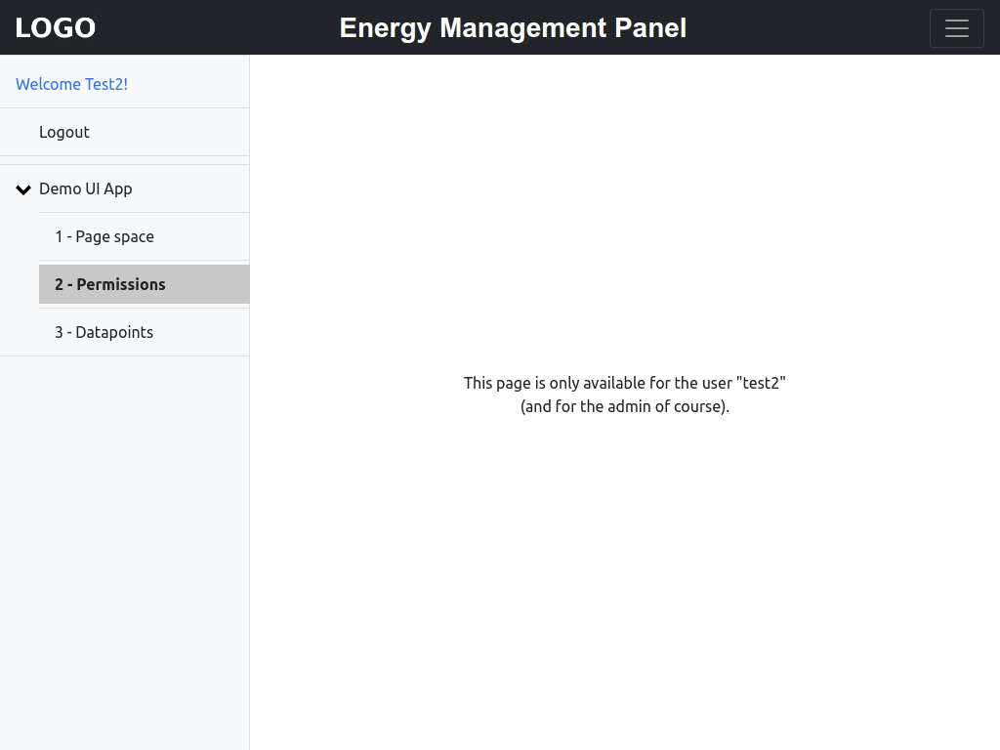

The permission system of the demo UI app has been implemented using the [django-guardian](https://github.com/django-guardian/django-guardian) package. The EMP provides an admin interface to control these permissions, beyond many other aspects of the data. In fact the core idea of the EMP is to provide pages that can be dynamically adjusted by configuring then in the admin page. In order to access the admin area visit http://localhost:8080/admin/ which will request a user/password combination.

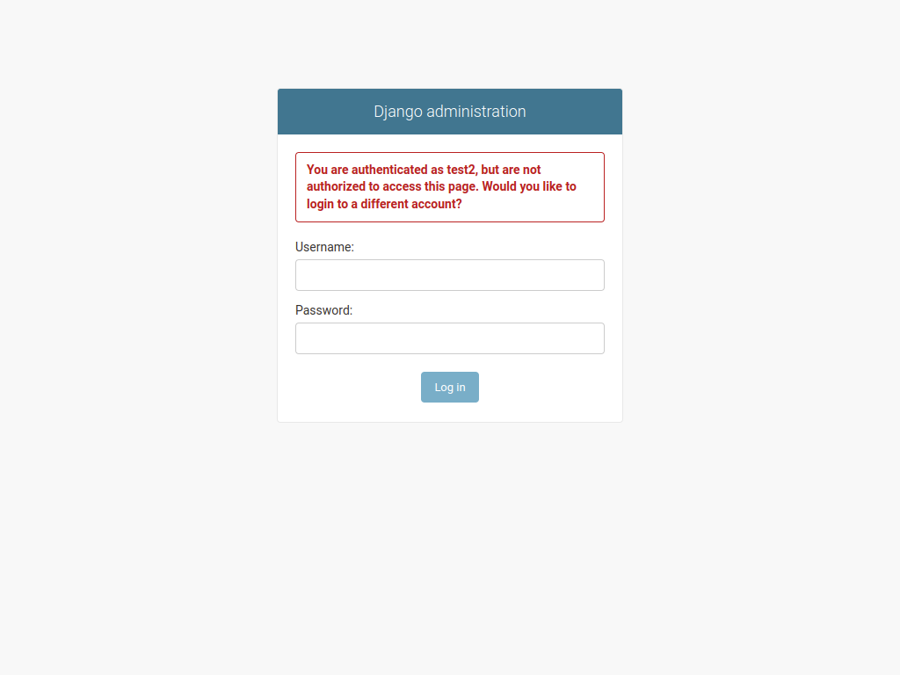

The admin user for this demo has the following credentials:

| Username: | Password: |
| --------- | --------- |
| emp       | emp       |

You should now see the root view of the admin space:

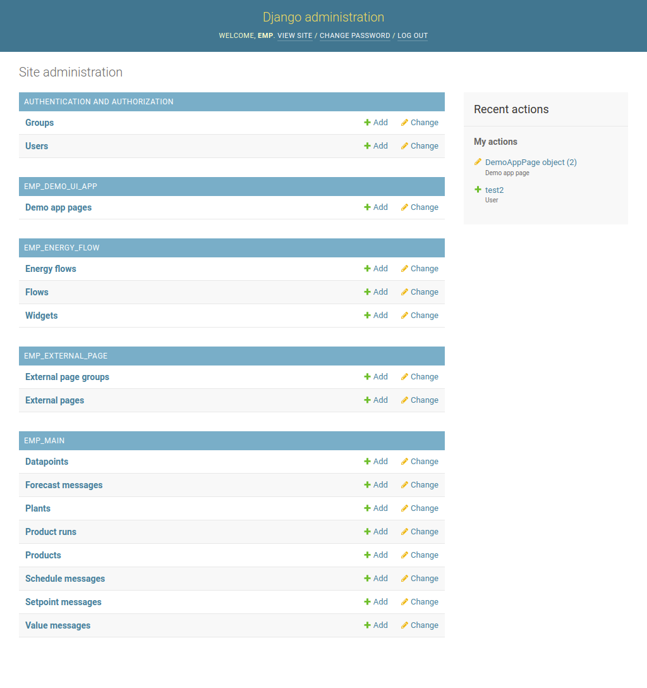

The demo version of the EMP provides admin pages to configure the users (this is a django default), the datapoints (which we will visit later) and the pages of the demo UI app. Click on "Demo app pages" to see the internal representation of the pages.

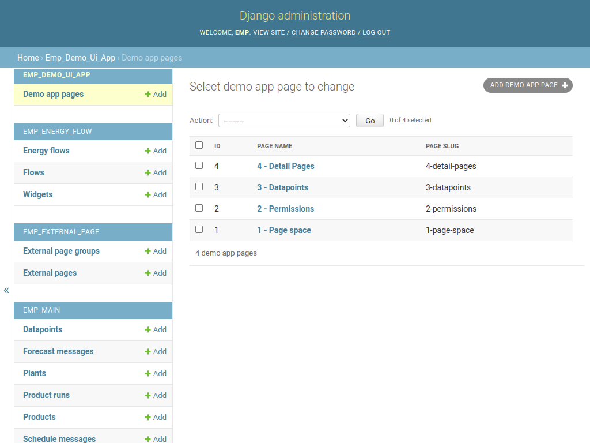

 It is worth noting that the demo UI app has been implemented in such way that every page corresponds to on entry in the database. Click on the "2 - Permissions" entry to view this object.

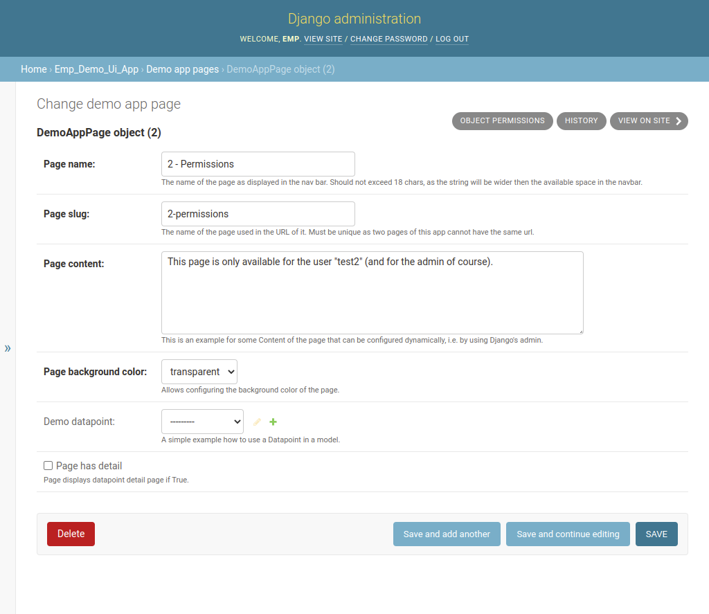

The demoUI app uses the field "Page name" as entry within the nav bar and the "Page slug" to build the URL of the page. "Page content", "Page background color" and "Demo datapoint" are used to generate the content of the page. The user restrictions of the page can be seen by clicking on the "OBJECT PERMISSIONS" button directly under the top bar of the admin page.

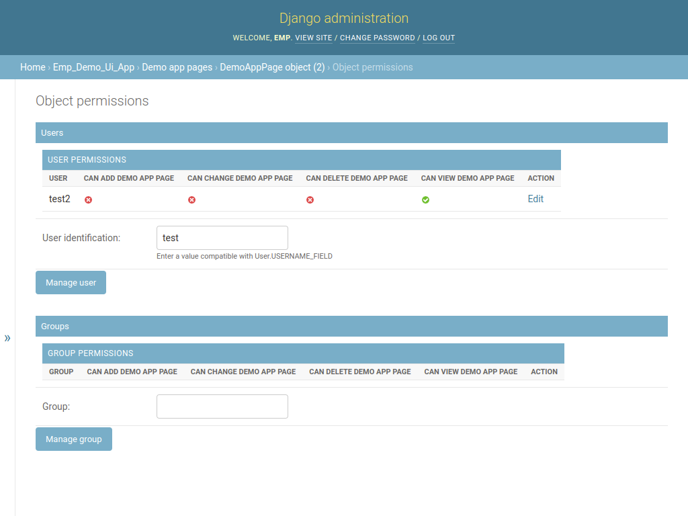

If you like you can change the current behavior by filling in "test" (without quotes) into the text box (next to User identification) and click on "Manage user". Adding the "Can view demo app page" permission in the following dialogue would allow the user `test` to access the restricted page.

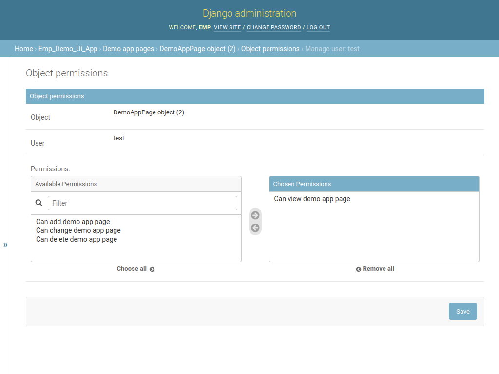 

Finally it should be noted that the exact behavior which page can be accessed by which user, including if such checking should be applied at all, depends on the implementation of the respective UI app. The implementation of the case here (using the django-guardian per object permission system) can be inspected in [source/emp/emp_demo_ui_app/apps.py](../source/emp/emp_demo_ui_app/apps.py).

Returning back to the intended application of the EMP, it is clear that a UI for interaction with a building will also need to display values emitted by hardware devices installed in that building to make sense. One may for example wish to implement a UI app with a page to display the current temperature of a room and allow users to modify the setpoint. In order to retrieve measurements and send actuator signals to hardware devices in buildings it is necessary to implement a "Datapoint interface" that takes care of this communication. Source code of a dummy interface that pushes random data into the EMP is provided in [source/demo_datapoint_interface](../source/demo_datapoint_interface) as an example. Assuming that such an interface exists, all incoming and outgoing information are related to datapoints. A datapoint is thereby by definition one source/sink of information in the hardware, for example a room climate senor in an office building may measure temperature and humidity values and has thus two datapoints. Respectively, a setpoint value of a heating is a datapoint too. For more information about datapoints and the the corresponding dataformat please refer to the interactive API documentation [http://localhost:8080/api/](http://localhost:8080/api/).

**Please be aware of the [BEMCom](https://bemcom.readthedocs.io/en/latest/) framework, a tool to for establishing communication with diverse hardware devices that integrates well with the EMP and which has a dedicated component, the [emp-link](https://bemcom.readthedocs.io/en/latest/05_service_reference.html#emp-link) to push measurements into the EMP.** 

To now see the how datapoints can be used, return to the EMP demo app by opening http://localhost:8080/demo/3-datapoints/


The demo utilizes a datapoint interface (source code at [source/demo_datapoint_interface](../source/demo_datapoint_interface/)) that pushes random values to the show datapoint every 5 seconds. Please note that the shown value on the page is updated too, without the page being reloaded (this currently only works if values are pushed to the `/emp/api/datapoint/value/latest/` endpoint of the API). This is one core feature of the EMP, the convenient integration and automatic update of datapoint values and metadata. Further note that pages can conveniently use datapoint values and metadata, to illustrate this visit http://localhost:8080/admin/emp_main/datapoint/1/change/ of the particular datapoint in a second window.

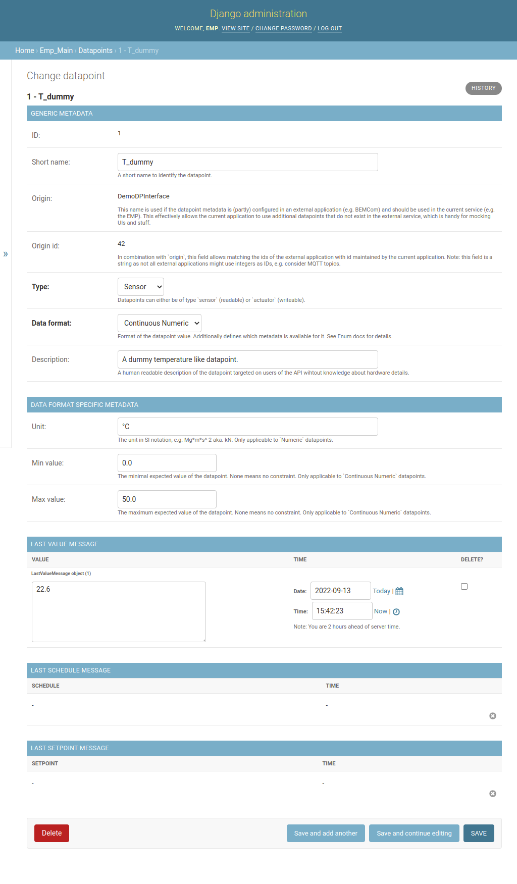

The "3 - Datapoints" page displays two fields of this datapoint, "Unit" and "Last value". You might change the unit if you like and see how it affects the page (don't forget to save and reload the page to make the changes effective).

## Shutdown the EMP

To shutdown the EMP application and to erase all data run the following command:

```bash
docker-compose down -v
```

